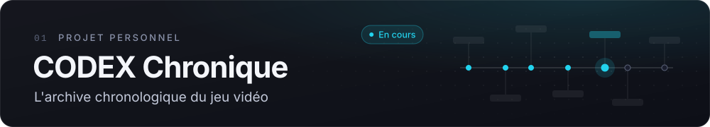
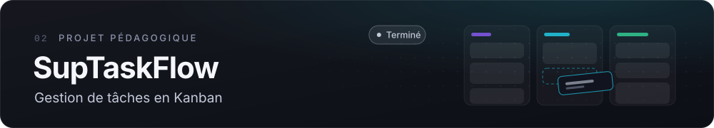
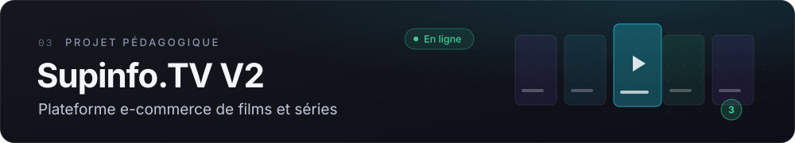
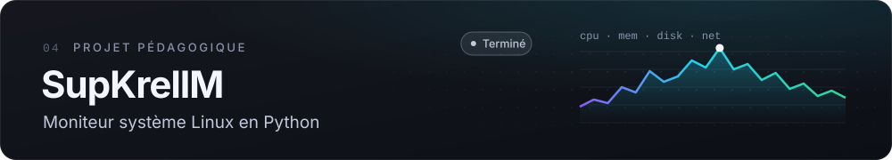

  <a href="https://www.obsiwebs.com"><b>Portfolio</b></a>&nbsp;&nbsp;·&nbsp;&nbsp;<a href="https://www.obsiwebs.com/projets">Projets</a>&nbsp;&nbsp;·&nbsp;&nbsp;<a href="https://www.obsiwebs.com/parcours">Parcours</a>&nbsp;&nbsp;·&nbsp;&nbsp;<a href="https://www.obsiwebs.com/cv/theo-andrimananarisoa-cv.pdf">CV</a>&nbsp;&nbsp;·&nbsp;&nbsp;<a href="mailto:theo.supinfo@gmail.com">Contact</a>

 

<code>01</code>&nbsp; À PROPOS

## Qui je suis

Étudiant en 2ᵉ année du Bachelor Informatique de **SUPINFO Lille**, je conçois des interfaces et des applications web complètes. Depuis septembre 2026, je suis **développeur web full-stack en alternance chez Evolve Marketing**, après un stage chez AILOOP sur la conception frontend et la modélisation de données d'un outil métier.

Ce qui m'attire d'abord, c'est l'interface et l'expérience utilisateur. Je développe mes compétences back-end pour construire des applications complètes. Cette année, je touche aussi aux systèmes, aux réseaux et à la sécurité, avant de choisir ma spécialisation en 3ᵉ année.

> Curiosité, rigueur, et le goût du concret : ce qui me motive, c'est de voir mon travail utilisé par quelqu'un.

<code>02</code>&nbsp; OUTILS

## Ce que j'utilise

| Domaine | Pratiqué | En apprentissage |
| :-- | :-- | :-- |
| **Front-end** | `HTML5` `CSS3` `JavaScript` `TypeScript` `React` `Next.js` `Vue.js` `Handlebars` | |
| **Back-end** | `Node.js` `Express.js` `Nest.js` `API REST` `Python` `PHP` | `C` `C++` |
| **Bases de données** | `MySQL` `PostgreSQL` `Supabase` | |
| **Outils & CMS** | `Git` `Docker` `XAMPP` `Strapi` | `Shopify` |
| **Déploiement & services** | `Vercel` `OVH` `Stripe` `Brevo` `Resend` `Mailtrap` | `Klaviyo` `Hostinger` |

<code>03</code>&nbsp; PROJETS

## Ce que je construis

Archive qui reconstitue la chronologie des licences de jeu vidéo : chaque événement daté, sourcé et remis dans l'ordre où il s'est produit. 
`Next.js` `TypeScript` `Modélisation de données`&nbsp;&nbsp;→&nbsp;[Démo](https://codex-chronique.vercel.app/)&nbsp;·&nbsp;[Fiche](https://www.obsiwebs.com/projets/codex-chronique)

Tableaux, colonnes et cartes avec comptes utilisateurs ; le glisser-déposer conserve la position des cartes en base. 
`React` `TypeScript` `Tailwind CSS` `Strapi`&nbsp;&nbsp;→&nbsp;[Dépôt](https://github.com/the0b51d14n/SupTaskFlow)&nbsp;·&nbsp;[Fiche](https://www.obsiwebs.com/projets/suptaskflow)

Vente de films et séries en ligne : catalogue alimenté par l'API TMDB, fiches détaillées, panier et tunnel de commande avec compte utilisateur. 
`PHP` `MySQL` `Docker`&nbsp;&nbsp;→&nbsp;[Démo](https://supinfo-tv-v2.vercel.app/)&nbsp;·&nbsp;[Dépôt](https://github.com/the0b51d14n/Supinfo.TV-V2)&nbsp;·&nbsp;[Fiche](https://www.obsiwebs.com/projets/supinfo-tv-v2)

Collecte processeur, mémoire, disques, températures et réseau en lisant directement `/proc` et `/sys`, puis les restitue en rapport HTML ou en tableau de bord temps réel. 
`Python` `Linux` `Tkinter`&nbsp;&nbsp;→&nbsp;[Dépôt](https://github.com/the0b51d14n/1PRO1-SupKrellM)&nbsp;·&nbsp;[Fiche](https://www.obsiwebs.com/projets/supkrellm)

Aussi : [Obsiwebs V2](https://github.com/the0b51d14n/Obsiwebs-V2) · [Supinfo.TV V1](https://github.com/the0b51d14n/Supinfo.TV) · [Boutique SPA](https://github.com/the0b51d14n/SPA---Boutique-en-ligne) · [Yearbook](https://github.com/the0b51d14n/yearbook) · [SUPSIMULATION](https://github.com/the0b51d14n/SUPSIMULATION) — toutes les fiches sur [obsiwebs.com/projets](https://www.obsiwebs.com/projets)

<code>04</code>&nbsp; ACTIVITÉ

## En chiffres

Généré chaque jour à partir de l'API GitHub par une action de ce dépôt. Si l'image ne s'affiche pas, l'activité reste consultable sur le <a href="https://github.com/the0b51d14n">calendrier de contributions</a>.

  <a href="mailto:theo.supinfo@gmail.com"><b>theo.supinfo@gmail.com</b></a>
   
  <a href="https://www.obsiwebs.com">obsiwebs.com</a>&nbsp;&nbsp;·&nbsp;&nbsp;<a href="https://www.obsiwebs.com/contact">Formulaire de contact</a>&nbsp;&nbsp;·&nbsp;&nbsp;<a href="https://www.obsiwebs.com/cv/theo-andrimananarisoa-cv.pdf">Télécharger mon CV</a>
   
  Lille, France · Réponse généralement sous 48 h

